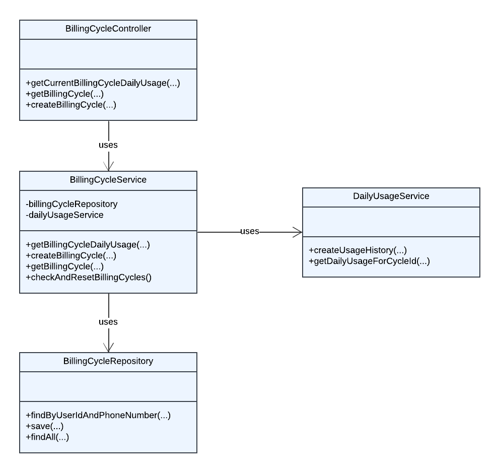

# Billing Cycle Management Service

This service is responsible for managing the billing cycles of users. It provides functionalities such as retrieving daily usage of a billing cycle, creating a new billing cycle, retrieving a billing cycle, and automatically resetting billing cycles at the end of each cycle period.

## Endpoints

### GET /api/billingcycle/dailyusage/{userId}

Retrieves the daily usage of a billing cycle.

**Request Parameters:**

- `userId`: The ID of the user.
- `phoneNumber`: The phone number of the user.

**Response:**

Returns a `UsageHistoryResponse` object containing the usage history of the user.

**Example Response:**

```json
{
  "usageHistory": [
    {
      "usageDate": "2024-05-18T23:54:07.926+00:00",
      "usedInMb": 0
    }
  ]
}
```
### GET /api/billingcycle/{userId}

Retrieves a billing cycle.  Request Parameters:  
 - userId: The ID of the user.
 - phoneNumber: The phone number of the user.
**Response:**
Returns a BillingCycleResponse object containing the billing cycles of the user.  Example Response:

```json
{
  "billingCycle": {
    "id": "123456",
    "startDate": "2024-05-18T23:54:07.926+00:00",
    "endDate": "2024-06-18T23:54:07.926+00:00"
  }
}
```
### POST /api/billingcycle

Creates a new billing cycle.

**Request Body:**

```json
{
  "userId": "123456",
  "phoneNumber": "1234567890"
}
```
**Response:**

Returns a HttpStatus.OK if the billing cycle was created successfully.

## Scheduler

The `checkAndResetBillingCycles()` method is scheduled to run every day. It checks all billing cycles and resets any that have ended. This is done by creating a new billing cycle and saving it in the repository. This method is annotated with `@Scheduled(fixedRate = 24 * 60 * 60 * 1000)`, which means it runs at a fixed interval of 24 hours.

## Error Handling

The service uses Spring's `ResponseStatusException` for error handling. When an error occurs, the service throws a `ResponseStatusException` with an appropriate HTTP status code and error message. Here are some examples:

- If the phone number does not match with the user id, it throws a `ResponseStatusException` with the HTTP status code `BAD_REQUEST` and the error message "Phone number does not match with the user id".

- If the billing cycle is not active, it throws a `ResponseStatusException` with the HTTP status code `BAD_REQUEST` and the error message "Billing cycle is not active".

- If the billing cycle is not found, it throws a `ResponseStatusException` with the HTTP status code `NOT_FOUND` and the error message "Billing cycle not found".

The service also logs the error details using SLF4J Logger, which can be helpful for debugging purposes.

In the client side, when a `ResponseStatusException` is thrown, the client should catch this exception and handle it appropriately, such as showing an error message to the user or retrying the request.

